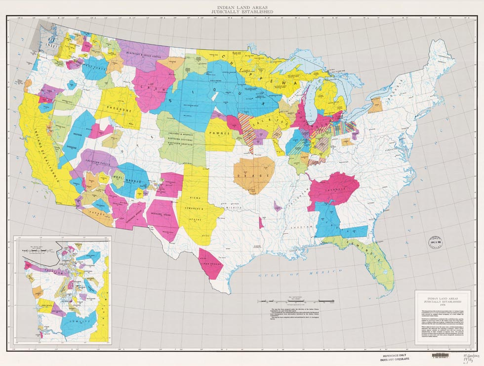
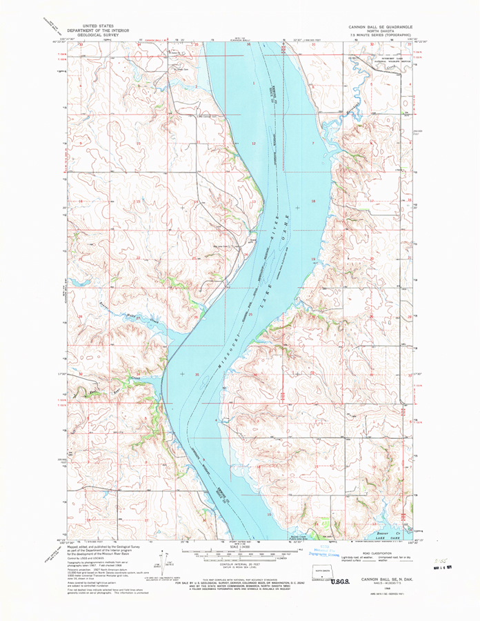

# United States Geological Survey

## Indian Land Areas

_Indian land areas judicially established, Prepared under the direction of the Indian Claims Commission_, [US Geological Survey](https://pubs.er.usgs.gov/publication/70114965), 1978. 

This map portrays the results of cases before the U.S. Indian Claims Commission or U.S. Court of Claims in which an American Indian tribe proved its original tribal occupancy of a tract within the continental United States.

- Publication type: Report
- Publication Subtype: USGS Unnumbered Series
- Title: Indian land areas judicially established
- DOI: 10.3133/70114965
- Year Published: 1978
- Language: English
- Publisher: U.S. Geological Survey
- Publisher location: Reston, VA
- Description: 50.16 x 37.95 inches
- Country: United States
- Projection: Albers Equal Area Projection
- Scale: 4000000

**Map Name** - date created, download date, source, file format, file size

- **[Indian land areas judicially established](Indian-Lands-plate-1.pdf)**, 197 - 04.15.2017, [source](https://pubs.er.usgs.gov/publication/70114965), PDF, _~6 MB_

## Topographic Maps

US Topo topographic maps are produced by the National Geospatial Program of the U.S. Geological Survey (USGS). The project was launched in late 2009, and the term “US Topo” refers specifically to quadrangle topographic maps published in 2009 and later. These maps are modeled on the familiar 7.5-minute quadrangle maps of the period 1947-1992, but are mass-produced from national GIS databases on a repeating cycle. US Topo maps repackage geographic information system (GIS) data in traditional map form; this benefits non-specialist map users, as well as applications that need traditional maps.

- [USGS Topographic Quadrangles](https://nationalmap.gov/ustopo/index.html) - starting point for downloading maps by search or digging through lists.

- [USGS Historical Topographic Maps](https://nationalmap.gov/historical/) - Historic maps are snapshots of the nation's physical and cultural features at a particular time. Maps of the same area can show how an area looked before development and provide a detailed view of changes over time. Historical maps are often useful to scientists, historians, environmentalists, genealogists and others researching a particular geographic location or area.

**Map Name** - date created, download date, source, file format, file size
- **[Cannonball Quadrangle North Dakota](4712109.pdf)** - 1968, 12.31.2016, [source](https://prd-tnm.s3.amazonaws.com/StagedProducts/Maps/HistoricalTopo/2/13183/4712109.pdf,), PDF, _~12 MB_
- **[Cannonball NW Quadrangle North Dakota](4712103.pdf)** - 1968, 12.31.2016, [source](https://prd-tnm.s3.amazonaws.com/StagedProducts/Maps/HistoricalTopo/2/13183/4712103.pdf), PDF, _~11.5 MB_
- **[Cannonball SE Quadrangle North Dakota](4712105.pdf)** - 1968, 12.31.2016, [source](https://prd-tnm.s3.amazonaws.com/StagedProducts/Maps/HistoricalTopo/2/13183/4712105.pdf), PDF, _~12.7 MB_
- **[Cannonball SW Quadrangle North Dakota](4712105.pdf)** - 1968, 12.31.2016, [source](https://prd-tnm.s3.amazonaws.com/StagedProducts/Maps/HistoricalTopo/2/13183/4712107.pdf), PDF, _~9.8 MB_
- **[Bullhead SW Quadrangle South Dakota](4910117.pdf)** - 1956, 12.31.2016, [source](https://prd-tnm.s3.amazonaws.com/StagedProducts/Maps/HistoricalTopo/2/13936/4910117.pdf), PDF, _~14.4 MB_
- **[Bullhead SW Quadrangle South Dakota](4910117.pdf)** - 1956/1974, 12.31.2016, [source](https://prd-tnm.s3.amazonaws.com/StagedProducts/Maps/HistoricalTopo/2/13936/4910117.pdf), PDF, _~14.4 MB_

#### Sample Map
Cannonball SE Quadrant:
