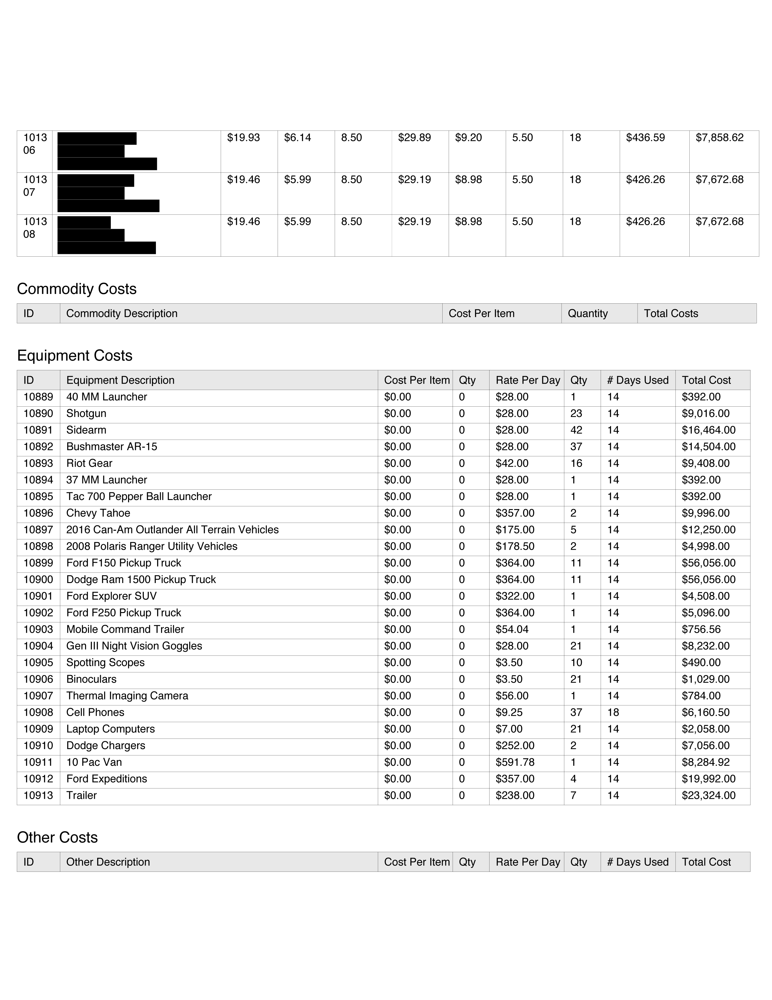
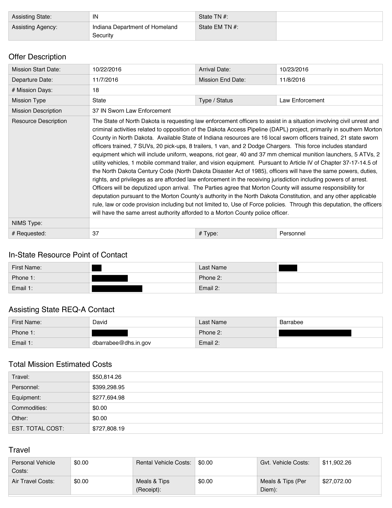

# Law Enforcement

- May 27th, 2017 - [TigerSwan mercenaries](https://theintercept.com/2017/05/27/leaked-documents-reveal-security-firms-counterterrorism-tactics-at-standing-rock-to-defeat-pipeline-insurgencies/) using military-style counter-terrorism measures against the peaceful. _source_: [the Intercept](https://theintercept.com/2017/05/27/leaked-documents-reveal-security-firms-counterterrorism-tactics-at-standing-rock-to-defeat-pipeline-insurgencies/)

# FOIA data

- [TigerSwan Internal Communications](tigerswan-intercept) - _via_ The Intercept
- [North Dakota Law Enforcement Requests - Indiana](ND-LE-reqs-Indiana) - _via_ Muckrock
- [North Dakota Law Enforcement Requests - Wisconsin](ND-LE-reqs-Wisconsin) - _via_ Muckrock
- [North Dakota Law Enforcement Requests - Wyoming](ND-LE-reqs-Wyoming) - _via_ Muckrock

Currently, these directories house FOIA documents requested by Muck Rock - specifically regarding North Dakota requests to neighboring states for support. For example, pages from Indiana's 'offer' to North Dakota:

page 4: 

page 1:

